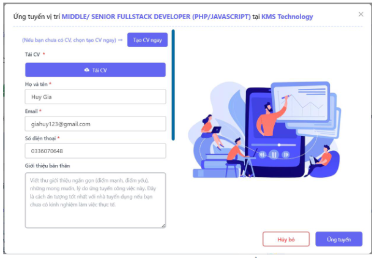

# IT Job Recruitment Website

- **Frontend:** ReactJS, TailWind CSS, Redux Toolkit Query, AntDesign, React-Chatbot-Kit.
- **Backend:** NodeJS, ExpressJS, MongoDB.

## Description:

- **Clients:** Sign up, sign in, job search, salary calculation, job application, resume creation, job post saving, chatbot for automatic applications, profile updates, and application status viewing and other features.
- **Companyies:** Sign up, sign in, logout, job postings, candidate confirmation, interview scheduling, and candidate management and other features.

## User Interface
### Login & Signup
#### Login User

- **User need register and login successfully to access application**
  

#### Login Company

- **Company need register and login successfully to access application**
  

#### Search for the fit job

- **User after logined successfully will be search for the fit job on search bar**
  
  

#### View All Job Posts

#### Admin Add Question Interview

#### Apply for job

#### View all applied user

#### Chatbot

#### Create Resume & Download Resume

#### Admin create schedule interview

#### Create set of questions interview
- **Create set of questions interview**

- **Edit set of question interview**

#### Admin Dashboard

#### Calculator Gross Net Salary

#### Interview Invitation

#### Admin Applies Management

#### Interview Schedule Management

#### Admin post the jobs 

#### User Profile

#### User save posts
- **User save post to see later**

- **View all saved posts**

#### Search for companies

#### Admin manage all post detail

#### User view all rooms type

